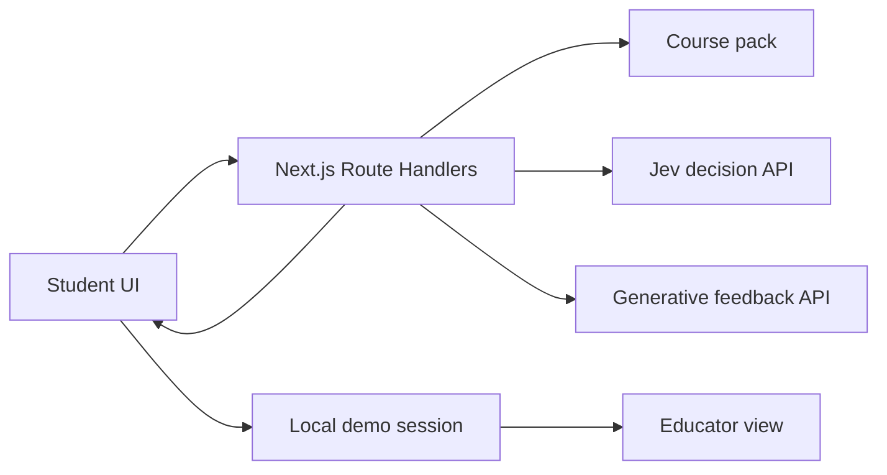

# Nervon Day 1 Build Specification

**Event:** Builders Pitch Fest, EdTech AI track  
**Team:** Fxtabs Private Limited / Cephalic Labs  
**Date:** 26 September 2026  
**Deadline:** Working prototype, one slide, and uploaded code by 4:30 pm IST

## 1. Product and problem

**Nervon** is a university learning coach. A student may know their score but still not know *which idea they misunderstood or what to study next*. Faculty cannot inspect every student's reasoning individually across a large cohort. Nervon turns a student's explained answer into a possible concept diagnosis, a focused learning step, and a new question that checks understanding. An educator view shows recurring gaps using clearly labelled synthetic cohort data.

The Day 1 prototype addresses **academic progress and learning outcomes** in the organizer's brief. It is a single working learner journey, not a university-wide platform.

### Assumptions to state to the judges

- A university can supply a course outline, educator-approved learning material, and question rubrics in a future pilot.
- Today's course pack, student records, and cohort are synthetic and authored during the challenge.
- A diagnosis is a *hypothesis based on a student's explanation*. A low-evidence response requests more explanation or educator review.
- No live LMS, registrar, payment, placement, or student-record integration is in this prototype.

## 2. Demo scope

Use **Classical Genetics (Biology)** as the one sample course, with three concepts:

1. Genotype versus phenotype and dominant versus recessive alleles.
2. Mendel's law of segregation and monohybrid crosses.
3. Mendel's law of independent assortment for unlinked genes and dihybrid crosses.

Prepare at least two distinct questions per concept, a short source snippet, an answer key, and a small misconception rubric. During the demo, enter two different explanations for the same question and show different diagnoses or an honest uncertainty state. Then accept a fresh response entered by a judge.

**Required learner loop:**

1. Student sees a course question and submits an answer **with an explanation**.
2. Nervon classifies a possible reasoning pattern using Jev and a course-specific rubric.
3. A generative model writes short feedback grounded in a source snippet, or Nervon asks for more reasoning.
4. Student receives a different question on the same concept.
5. Nervon evaluates the second attempt and updates the local demo session.
6. Educator view shows the current session alongside clearly labelled synthetic cohort patterns.

No prewritten response may be presented as live AI inference. Question banks, rubric labels, source text, and UI workflow may be authored in advance during the challenge.

## 3. Stack decision

| Concern | Day 1 choice | Reason |
| --- | --- | --- |
| Application | Next.js App Router, TypeScript, React | One repository and fast UI development. |
| Rendering | Server Components for the initial course and educator pages; Client Components for interactive forms | Keep the initial page server-rendered while the attempt flow stays responsive. |
| Server API | Next.js Route Handlers | Server-side keys, input validation, and one deployment process. |
| Decision model | Jev through OpenRouter's Decisions API, called from a server-side adapter | Typed choices over a small reasoning rubric. |
| Teaching feedback | DeepSeek V4.1 Flash through OpenRouter, called server-side | Jev does not generate an explanation. The feedback model receives only the relevant course material. |
| Data | Versioned local JSON course pack and synthetic cohort; browser `localStorage` for the current demo session | No database setup or real student data. |
| Styling | Tailwind and shadcn Base UI components | Responsive, accessible forms and consistent learning screens. |
| Python | FastAPI + Pydantic **only if** a tuned Laya checkpoint is ready | The live Jev and generative API path needs no Python process. |

The Next.js server reads the private course pack. It exposes question prompts and public source snippets to the browser but keeps answer keys and API keys server-side. **Nervon is the event prototype name**; the day-two Aorta venture deck has a separate purpose.

### Service boundary



The optional Laya service implements the same internal decision interface as Jev; it does not change the UI or endpoint contract.

## 4. Repository shape

```text
nervon/
├── app/
│   ├── page.tsx                  # Course entry, server-rendered
│   ├── learn/page.tsx            # Learner page, server-rendered shell
│   ├── educator/page.tsx         # Educator view, synthetic + local session
│   └── api/
│       ├── analyze/route.ts      # Live diagnosis and feedback
│       └── verify/route.ts       # Second-attempt assessment
├── components/
│   ├── AttemptForm.tsx
│   ├── FeedbackPanel.tsx
│   └── EducatorSummary.tsx
├── data/
│   ├── classical-genetics-course.json # Questions, keys, rubrics, source snippets
│   └── synthetic-cohort.json
├── lib/
│   ├── course.ts                 # Safe public projection of course data
│   ├── decision.ts               # Shared decision interface
│   ├── jev.ts                    # Jev implementation
│   ├── feedback.ts               # Generative model and source validation
│   └── validation.ts
└── README.md                     # Run steps, assumptions, sources, disclosure
```

The team can rename files when implementation demands it, but preserve the separation between UI, course data, model adapters, and API handlers. Keep secrets in `.env.local`; commit an `.env.example` containing key names only.

## 5. Data contract

The course pack is a local JSON file. Each concept includes an ID, learning objective, short approved source snippets with IDs, misconception labels with plain-language criteria, and at least two questions with distinct IDs. Question keys and verification rubrics remain server-side.

The Day 1 pack uses schema version 1 and content version 1.0.0. Its challenge-authored source summaries are pending educator review, not university-approved material. Browser-safe types and input limits are defined in `lib/contracts.ts`; the detailed endpoint handoff is in [API-CONTRACT.md](API-CONTRACT.md).

### Analyze request

```ts
type AnalyzeRequest = {
  courseId: "classical-genetics";
  questionId: string;
  answer: string;
  explanation: string;
  localSessionId: string;
};
```

### Analyze response

```ts
type AnalyzeResponse = {
  attemptId: string;
  conceptId: string;
  diagnosis: {
    label: string;
    evidence: string;             // Quote or concise account of the student's words
    decisionProvider: "jev" | "generative-baseline" | "laya";
    reviewRequired: boolean;
  };
  feedback: {
    text: string;                 // Short, specific, source-grounded feedback
    sourceIds: string[];          // Must exist in the course pack
  } | null;
  nextQuestion: {
    id: string;
    prompt: string;
    choices?: string[];
  } | null;
};
```

### Verify request and response

`POST /api/verify` accepts `attemptId`, `nextQuestionId`, `answer`, and `explanation`. It returns `status` (`verified`, `needsPractice`, or `educatorReview`) and a short reason. The browser appends the result to its local session; there is no server-side student database.

Analyze returns `attemptId` as an opaque signed token binding the course-pack version, original question, assigned verification question, and local session ID, with a two-hour expiry. Include no student responses or assessment keys. The future verify handler must reject invalid, expired, or mismatched tokens with HTTP 400. Signing and the analyze endpoint are implemented; verification remains a later milestone.

When evidence is insufficient or contradictory enough to prevent a defensible diagnosis, return `reviewRequired: true`, `feedback: null`, and `nextQuestion: null`. The UI requests clarification or educator review before advancing.

Validate required fields, length limits, and all IDs on the server. A malformed request gets an explicit 400 response. A failed provider call gets a visible error or a **disclosed live-model fallback**, never a canned diagnosis masquerading as inference.

## 6. AI behavior

### Jev decision

Send Jev the question, reference answer, student answer, explanation, and a concise rubric. For a monohybrid-cross question under complete dominance, ask a `choice` question over a few patterns such as:

- Assumes a dominant phenotype always implies a homozygous dominant genotype.
- Recognizes that a dominant phenotype can arise from either a homozygous dominant or a heterozygous genotype.
- Gives unrelated reasoning.
- Provides too little evidence to identify a pattern.

Also ask whether the response contains enough reasoning to choose a pattern. Record the returned distribution for debugging, but **do not present its confidence as validated educational accuracy**. If the answer is ambiguous or lacks evidence, request clarification or mark the attempt for educator review. Keep the option list small and definitions specific to the question.

### Generative feedback

Give the feedback model the student response, the diagnosis, and the short course snippet relevant to the selected concept. Ask for two to four sentences: identify the reasoning gap using the student's own words, explain the correct distinction, and state one next action. Require source IDs in structured output and reject IDs missing from the course pack. A diagnosis that contradicts the student's explanation should be marked for review instead of confidently taught.

Select a different verification question from the course pack. The second attempt should test the concept in a new context. Do not claim that a correct immediate response proves lasting learning; delayed recall would be measured in a later pilot.

### Real-model fallback

If Jev access fails, the generative model may return a structured diagnosis against the same rubric before writing feedback. Display or log `decisionProvider: "generative-baseline"`. This is still a live AI path. A static sample response may be used to lay out the UI during development, but must be disconnected from the judged demo.

## 7. Optional Laya experiment

Run the Laya notebook outside the critical demo path. Synthetic examples should vary the question context, phrasing, correct and incorrect reasoning, and insufficient-evidence cases. Manually inspect labels. Split the train and held-out sets by scenario or paraphrase family to avoid testing near-duplicates. Compare Laya, Jev, and the baseline on the **same unseen examples**, recording per-label errors, abstentions, and latency.

A small dummy set can test that fine-tuning and the adapter work; it cannot establish diagnostic quality. Integrate Laya into the demo only if training finishes and the held-out results support it. If a Python service becomes necessary, expose one FastAPI `/classify` endpoint that returns the same decision object as the Jev adapter.

## 8. Ownership and milestones

| Time IST | Saumyajit | Yaazh |
| --- | --- | --- |
| 11:30–12:00 | Finalize rubric, course pack, API response shape, and clean repository. | Scaffold Next.js screens using temporary layout fixtures. |
| 12:00–13:30 | Get `/api/analyze` working with a real generative API; add Jev adapter and validation. | Complete learner journey and connect to the live endpoint. |
| 13:30–14:45 | Test varied explanations; implement verification and review state. | Build educator aggregation and local session state. |
| 14:45–16:00 | Integrate and handle invalid input, source checks, and model failures. | Polish screens and run the journey with fresh inputs. |
| 16:00–16:30 | Freeze and upload code by the 4:30 pm cutoff; prepare technical answers. | Finalize exactly one Day 1 slide and rehearse the seven-minute demo. |
| 17:00–17:30 | Keep the local build running and present. | Check browser/network and rehearse the handoff. |

Give coding agents non-overlapping files and one integration owner. An optional background agent may prepare the Laya data and notebook, provided this takes no time from the two participants' integration work. Make no use of private or proprietary pre-challenge team code. Any eligible public code, model, or content used must be disclosed as required by the event brief.

## 9. Demo acceptance gate

- [x] Two distinct free-text explanations cause meaningfully different live diagnoses or an honest uncertainty state.
- [ ] A fresh judge-written response triggers a real model request.
- [x] Feedback cites a source ID that exists in the course pack.
- [x] The student receives a *different* question testing the same concept.
- [x] The second attempt changes the current session and educator view.
- [x] Errors are visible; secrets and answer keys stay server-side.
- [x] All student and cohort data are synthetic and visibly labelled.
- [ ] The repo contains only eligible code and includes setup steps and attributions.
- [x] Exactly one slide frames the chosen problem, solution loop, synthetic-data assumption, and next validation step.

## 10. One-slide framing

**Problem:** A score tells a student what they missed, but rarely why or what to do next. Faculty cannot inspect every explanation individually.  
**Working solution:** Nervon reads an explained answer, identifies a possible concept gap, gives course-grounded feedback, and checks understanding with a new question.  
**AI contribution:** Jev makes a typed reasoning decision; a generative model writes feedback from supplied course material.  
**Next validation:** Faculty-label real examples with consent and measure performance on unseen questions and later recall.

## References

- Organizer-supplied *EdTech AI Track Day 1 Problem Brief*, received 26 September 2026.
- [Next.js Server and Client Components](https://nextjs.org/docs/app/getting-started/server-and-client-components) and [Route Handlers](https://nextjs.org/docs/app/getting-started/route-handlers).
- [TypeSafe System One API](https://api.typesafe.ai/docs).
- [Laya repository and fine-tuning guide](https://github.com/NandhaKishorM/laya).


## Implementation status — 26 September 2026

Both owners’ technical milestones are implemented: course pack and safe projection,
live analyze and verification, strict attempt binding, responsive learner flow,
persistent browser session, separate synthetic cohort, educator history, and
visible review/error states. The one-slide PDF and seven-minute presenter runbook
are in [docs/demo/REHEARSAL.md](../demo/REHEARSAL.md). Automated and live acceptance
results are recorded there. The optional Laya experiment is not part of this release.

The fresh-input path was exercised with newly authored synthetic browser input;
a judge’s actual response and the human rehearsal occur at the event. Uploading
code still requires the team’s event destination; no remote push or upload was
performed. Content review and educational validation remain future pilot work.
